# 常见的排序算法

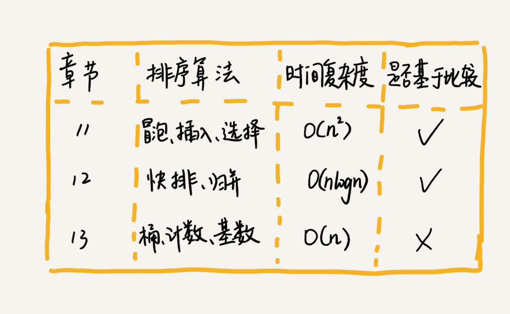


# 不同算法之间需要考虑的问题

- 比较次数和移动次数
- 排序是否原地（空间复杂度O（1））
- 排序是否稳定（稳定的排序可以保证有序性）


# 冒泡排序

> 相邻的两个元素两两比价，观察是否满足大小要求，不满足就进行交换。一次冒泡会让至少一个元素移动到它应该在的位置，重复 n 次，就完成了 n 个数据的排序工作。
> 
> <span style="color:red">注意：当某次没有交换数据，说明就已经达到了完全有序状态</span>

<b>一次冒泡的过程如下:</b>

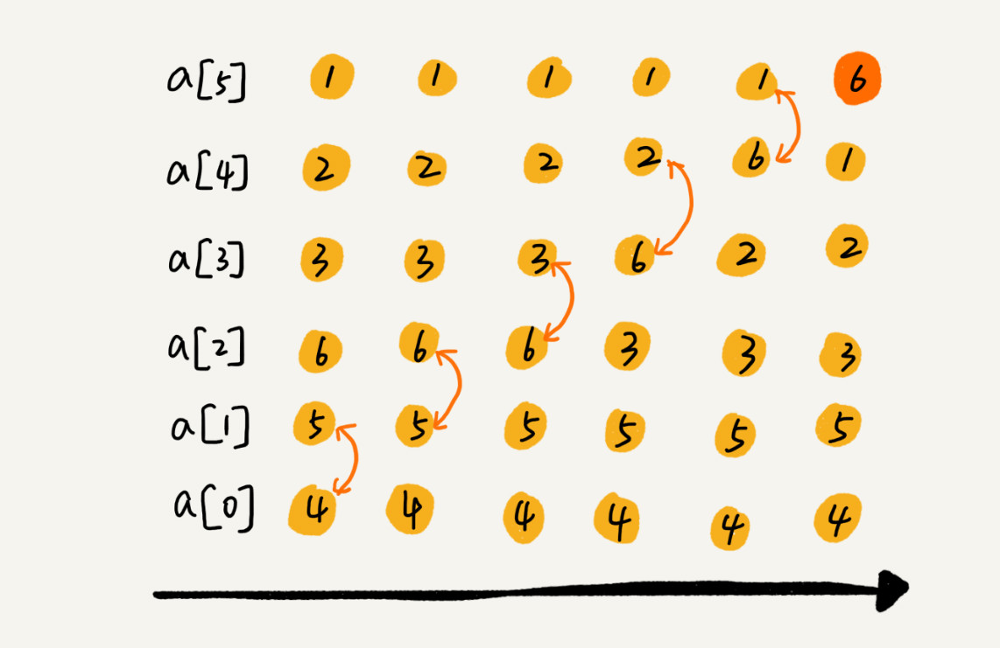

<b>多次冒泡后的结果：</b>

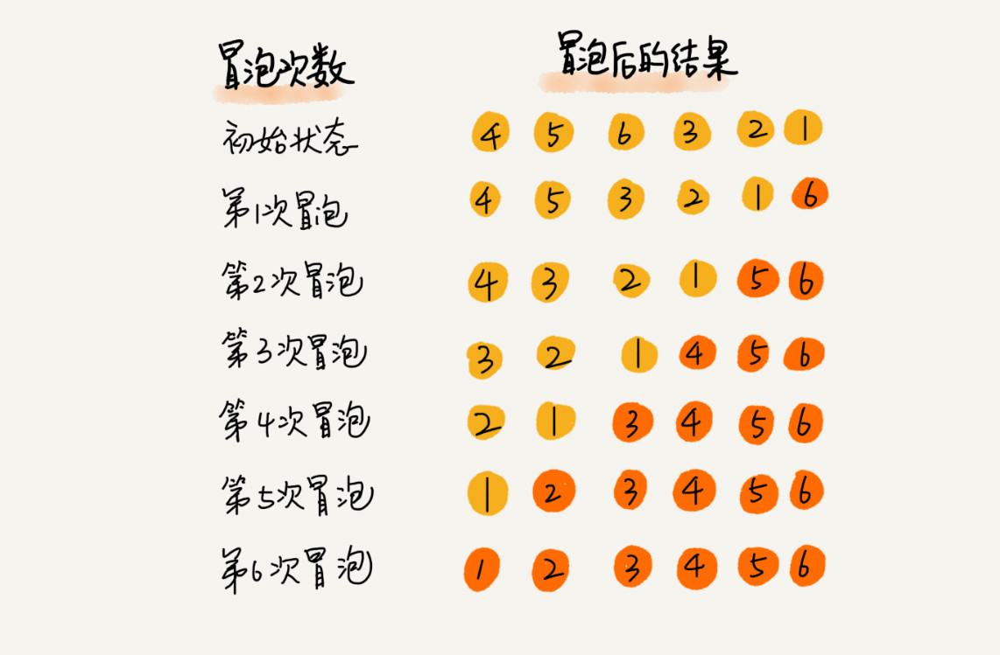

<b>代码示例：</b>
```java
// 冒泡排序，a表示数组，n表示数组大小
public void bubbleSort(int[] a, int n) {
  if (n <= 1) return;
 
 for (int i = 0; i < n; ++i) {
    // 提前退出冒泡循环的标志位
    boolean flag = false;
    for (int j = 0; j < n - i - 1; ++j) {
      if (a[j] > a[j+1]) { // 交换
        int tmp = a[j];
        a[j] = a[j+1];
        a[j+1] = tmp;
        flag = true;  // 表示有数据交换      
      }
    }
    if (!flag) break;  // 没有数据交换，提前退出
  }
}
```

<b>结论：</b>
- 原地的排序算法
- 稳定的排序算法
- 最好的情况下，只需要一次冒泡，时间复杂度O(n)。最坏的的时间复杂度O(n²)


# 插入排序
> 我们将数组中的数据分为两个区间，<b>已排序区间</b>和<b>未排序区间</b>。初始已排序区间只有一个元素，就是数组的第一个元素。插入算法的核心思想是取未排序区间中的元素，在已排序区间中找到合适的插入位置将其插入，并保证已排序区间数据一直有序。重复这个过程，直到未排序区间中元素为空，算法结束。


<b>插入过程：</b>
>插入排序也包含两种操作，一种是<b>元素的比较</b>，一种是<b>元素的移动</b>。当我们需要将一个数据 a 插入到已排序区间时，需要拿 a 与已排序区间的元素依次比较大小，找到合适的插入位置。找到插入点之后，我们还需要将插入点之后的元素顺序往后移动一位，这样才能腾出位置给元素 a 插入。

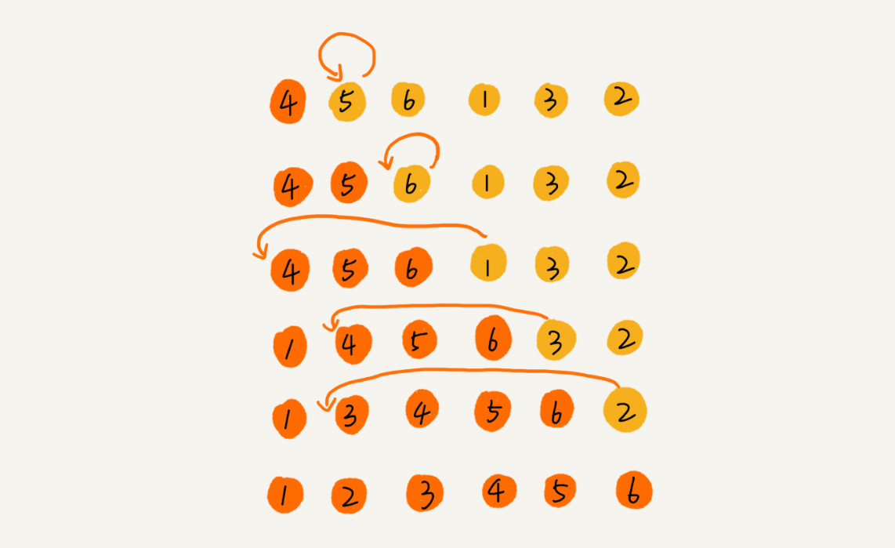

<b>代码示例：</b>

```java

// 插入排序，a表示数组，n表示数组大小
public void insertionSort(int[] a, int n) {
  if (n <= 1) return;

  for (int i = 1; i < n; ++i) {
    int value = a[i];
    int j = i - 1;
    // 查找插入的位置
    for (; j >= 0; --j) {
      if (a[j] > value) {
        a[j+1] = a[j];  // 数据移动
      } else {
        break;
      }
    }
    a[j+1] = value; // 插入数据
  }
}
```

<b>结论：</b>
- 原地的排序算法
- 稳定的排序算法
- 最好情况，已经是有序的，O(n)。最坏情况O(n²)

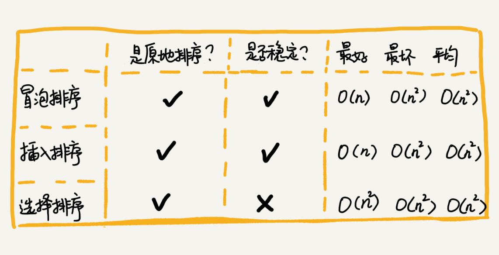

# 选择排序
> 选择排序算法的实现思路有点类似插入排序，也分已排序区间和未排序区间。但是选择排序每次会从未排序区间中找到最小的元素，将其放到已排序区间的末尾。

<b>选择排序原理示意图：</b>
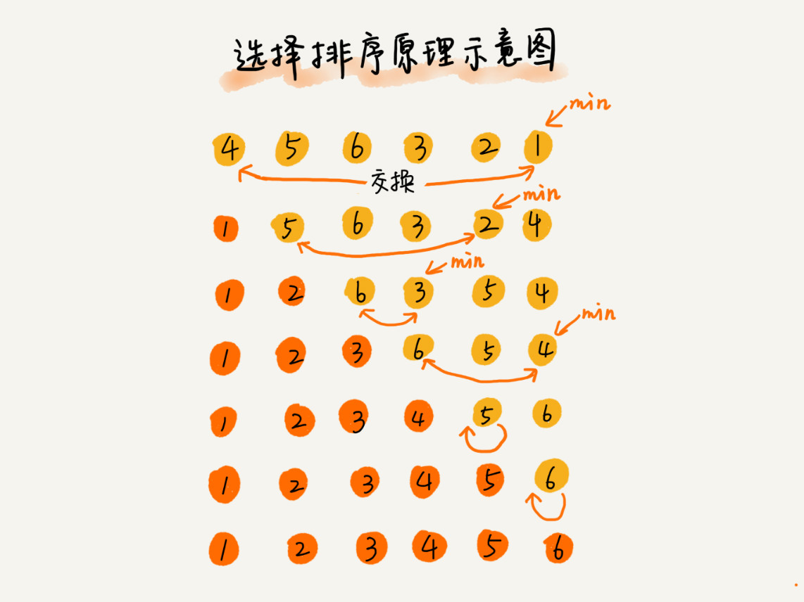

<b>结论：</b>
- 原地的排序算法
- 不稳定的排序算法
- 时间复杂度都是O(n²)


# 归并排序
> 归并排序的核心思想还是蛮简单的。如果要排序一个数组，我们先把数组从中间分成前后两部分，然后对前后两部分分别排序，再将排好序的两部分合并在一起，这样整个数组就都有序了。

<b>归并排序原理示意图</b>
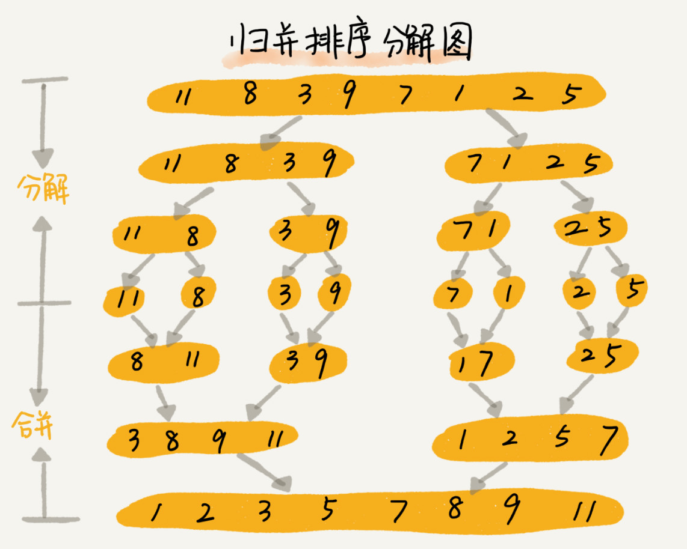

```java
    /**
     * 归并排序
     *
     * @param data
     */
    private void mergeSort(int[] data) {
        mergeSortChild(data, 0, data.length - 1);
    }

    private void mergeSortChild(int[] data, int l, int r) {
        if (l >= r) return;

        int mid = (l + r) / 2;

        mergeSortChild(data, l, mid);
        mergeSortChild(data, mid + 1, r);

        merge(data, l, mid, r);
    }

    private void merge(int[] data, int l, int mid, int r) {

        int i = l;
        int j = mid + 1;
        int k = 0;

        int[] tempData = new int[r - l + 1];

        while (i <= mid && j <= r) {
            if (data[i] <= data[j]) {
                tempData[k++] = data[i++];
            } else {
                tempData[k++] = data[j++];
            }
        }

        while (j <= r) {
            tempData[k++] = data[j++];
        }

        while (i <= mid) {
            tempData[k++] = data[i++];
        }

        //值回写给data
        for (int num : tempData) {
            data[l++] = num;
        }
    }
```
>归并排序算法是一种在任何情况下时间复杂度都比较稳定的排序算法，这也使它存在致命的缺点，即归并排序不是原地排序算法，空间复杂度比较高，是 O(n)。正因为此，它也没有快排应用广泛。


# 快速排序
>历 p 到 r 之间的数据，将小于 pivot 的放到左边，将大于 pivot 的放到右边，将 pivot 放到中间。经过这一步骤之后，数组 p 到 r 之间的数据就被分成了三个部分，前面 p 到 q-1 之间都是小于 pivot 的，中间是 pivot，后面的 q+1 到 r 之间是大于 pivot 的
>

<b>快速排序原理示意图</b>
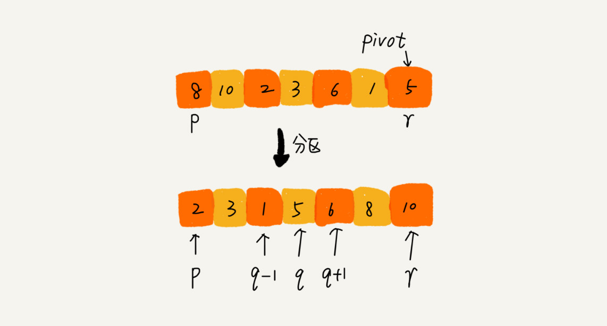


```java
    public void quickSort(int[] data) {
        quickSortChild(data, 0, data.length - 1);
    }

    private void quickSortChild(int[] data, int l, int r) {
        if (l >= r) {
            return;
        }

        int p = partition(data, l, r);

        quickSortChild(data, l, p-1);
        quickSortChild(data, p + 1, r);
    }

    private int partition(int[] arr, int p, int r) {
        int pivot = arr[r];
        int i = p;
        for (int j = p; j < r; j++) {
            if (arr[j] < pivot) {
                int temp = arr[i];
                arr[i++] = arr[j];
                arr[j] = temp;
            }
        }
        int temp = arr[i];
        arr[i] = arr[r];
        arr[r] = temp;

        return i;
    }
```

<b>获取分区点方法</b>
>我们通过游标 i 把 A[p...r-1]分成两部分。A[p...i-1]的元素都是小于 pivot 的，我们暂且叫它“已处理区间”，A[i...r-1]是“未处理区间”。我们每次都从未处理的区间 A[i...r-1]中取一个元素 A[j]，与 pivot 对比，如果小于 pivot，则将其加入到已处理区间的尾部，也就是 A[i]的位置。
> 
> 
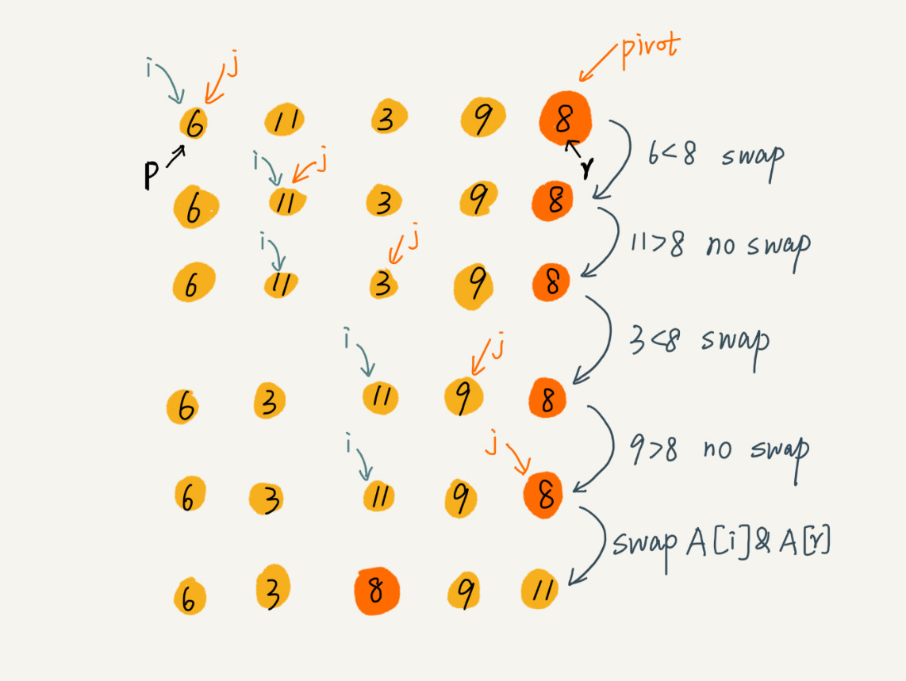

>快速排序算法虽然最坏情况下的时间复杂度是 O(n²)，但是平均情况下时间复杂度都是 O(nlogn)。不仅如此，快速排序算法时间复杂度退化到 O(n²) 的概率非常小，我们可以通过合理地选择 pivot 来避免这种情况

# 归并和快排对比
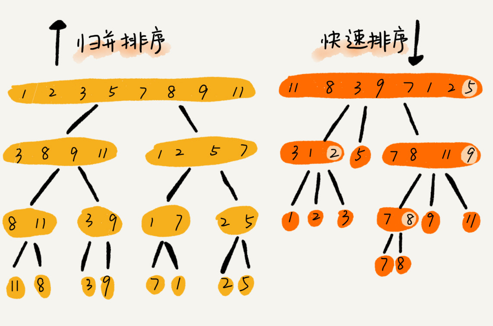

# 线性排序
- 桶排序
- 计数排序
- 基数排序

>之所以能做到线性的时间复杂度，主要原因是，这三个算法是非基于比较的排序算法，都不涉及元素之间的比较操作
## 桶排序
<b>如何根据年龄给 100 万用户排序？</b>
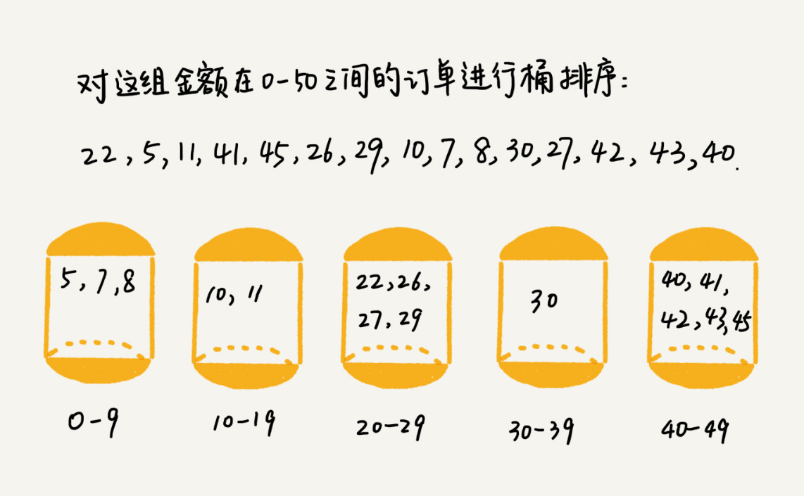

<b>使用场景</b>
>桶排序比较适合用在外部排序中。所谓的外部排序就是数据存储在外部磁盘中，数据量比较大，内存有限，无法将数据全部加载到内存中。
> 
> 例如：我们有 10GB 的订单数据，我们希望按订单金额（假设金额都是正整数）进行排序，但是我们的内存有限，只有几百 MB，没办法一次性把 10GB 的数据都加载到内存中。这个时候该怎么办呢？


## 计数排序
>计数排序其实是桶排序的一种特殊情况。当要排序的 n 个数据，所处的范围并不大的时候，比如最大值是 k，我们就可以把数据划分成 k 个桶。每个桶内的数据值都是相同的，省掉了桶内排序的时间。


<b>如何给50w考生快速排序得出名次</b>

## 基数排序
<b>如何给10w个手机号从小到大排序</b>

>借助稳定排序算法，这里有一个巧妙的实现思路。还记得我们第 11 节中，在阐述排序算法的稳定性的时候举的订单的例子吗？我们这里也可以借助相同的处理思路，先按照最后一位来排序手机号码，然后，再按照倒数第二位重新排序，以此类推，最后按照第一位重新排序。经过 11 次排序之后，手机号码就都有序了。
>
> 

# 总结
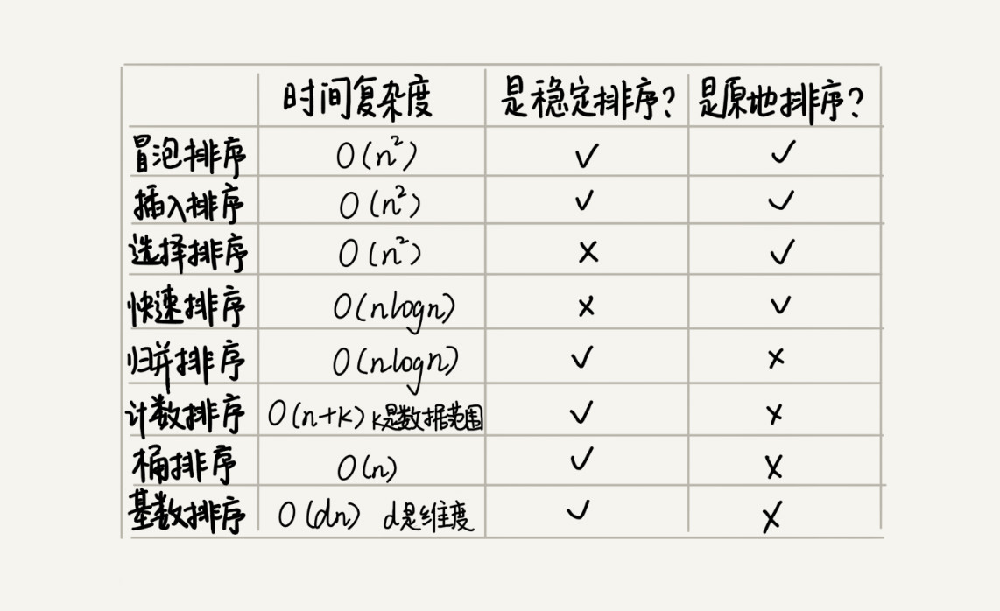

