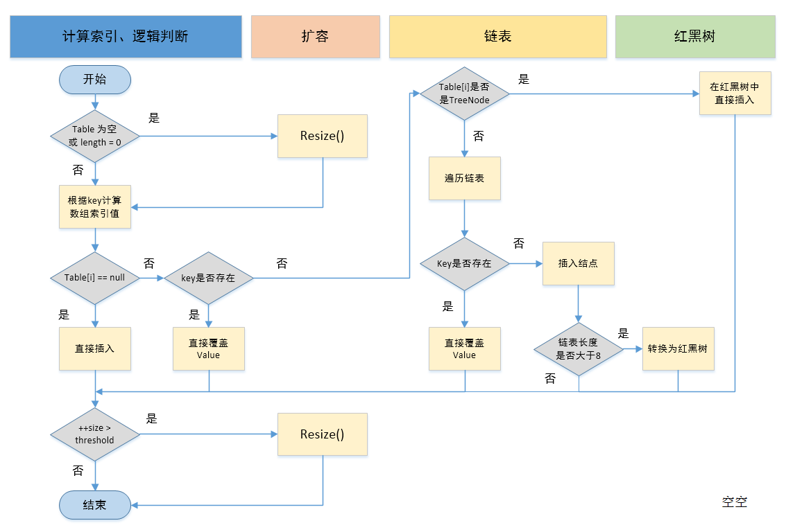

# 源码分析


# 类图


## ArrayList.java
```java
public class ArrayList<E> extends AbstractList<E> implements List<E>, RandomAccess, Cloneable, Serializable {
    // 序列化id
    private static final long serialVersionUID = 8683452581122892189L;
    // 默认初始的容量
    private static final int DEFAULT_CAPACITY = 10;
    // 一个空对象
    private static final Object[] EMPTY_ELEMENTDATA = new Object[0];
    // 一个空对象，如果使用默认构造函数创建，则默认对象内容默认是该值
    private static final Object[] DEFAULTCAPACITY_EMPTY_ELEMENTDATA = new Object[0];
    // 当前数据对象存放地方，当前对象不参与序列化
    transient Object[] elementData;
    // 当前数组长度
    private int size;
    // 数组最大长度
    private static final int MAX_ARRAY_SIZE = Integer.MAX_VALUE - 8;

    /**
     * 注意：此时我们创建的ArrayList对象中的elementData中的长度是1，size是0
     * 当进行第一次add的时候，elementData将会变成默认的长度：10.
     */
    public ArrayList() {
        this.elementData = DEFAULTCAPACITY_EMPTY_ELEMENTDATA;
    }

    public ArrayList(int initialCapacity) {
        if (initialCapacity > 0) {
            this.elementData = new Object[initialCapacity];
        } else if (initialCapacity == 0) {
            this.elementData = EMPTY_ELEMENTDATA;
        } else {
            throw new IllegalArgumentException("Illegal Capacity: " +
                    initialCapacity);
        }
    }

    public ArrayList(Collection<? extends E> c) {
        elementData = c.toArray();
        if ((size = elementData.length) != 0) {
            // c.toArray might (incorrectly) not return Object[] (see 6260652)
            if (elementData.getClass() != Object[].class)
                elementData = Arrays.copyOf(elementData, size, Object[].class);
        } else {
            // replace with empty array.
            this.elementData = EMPTY_ELEMENTDATA;
        }
    }

    /**
     *
     * add主要的执行逻辑如下：
     * 1）确保数组已使用长度（size）加1之后足够存下 下一个数据
     * 2）修改次数modCount 标识自增1，如果当前数组已使用长度（size）加1后的大于当前的数组长度，则调用grow方法，增长数组，grow方法会将当前数组的长度变为原来容量的1.5倍。
     * 3）确保新增的数据有地方存储之后，则将新元素添加到位于size的位置上。
     * 4）返回添加成功布尔值。
     *
     * @param e
     * @return
     */
    public boolean add(E e) {
        ensureCapacityInternal(size + 1);  // Increments modCount!!
        elementData[size++] = e;
        return true;
    }

    /**
     * 1）确保数插入的位置小于等于当前数组长度，并且不小于0，否则抛出异常
     * 2）确保数组已使用长度（size）加1之后足够存下 下一个数据，如果存不下就调用grow方法扩容
     * 3）确保有足够的容量之后，使用System.arraycopy 将需要插入的位置（index）后面的元素统统往后移动一位。
     * 注意：使用该方法的话将导致指定位置后面的数组元素全部重新移动，即往后移动一位。
     *
     * @param index
     * @param element
     */
    public void add(int index, E element) {
        rangeCheckForAdd(index);

        ensureCapacityInternal(size + 1);  // Increments modCount!!
        System.arraycopy(elementData, index, elementData, index + 1,
                size - index);
        elementData[index] = element;
        size++;
    }

    /**
     * 确保set的位置小于当前数组的长度（size）并且大于0，
     * 获取指定位置（index）元素，然后放到oldValue存放，将需要设置的元素放到指定的位置（index）上，然后将原来位置上的元素oldValue返回给用户。
     * @param index
     * @param element
     * @return
     */
    public E set(int index, E element) {
        rangeCheck(index);

        E oldValue = elementData(index);
        elementData[index] = element;
        return oldValue;
    }

    /**
     * 1）判断索引有没有越界
     * 2）自增修改次数
     * 3）将指定位置（index）上的元素保存到oldValue
     * 4）将指定位置（index）上的元素都往前移动一位
     * 5）将最后面的一个元素置空，好让垃圾回收器回收
     * 6）将原来的值oldValue返回
     * 注意：调用这个方法不会缩减数组的长度，只是将最后一个数组元素置空而已。
     *
     * @param index
     * @return
     */
    public E remove(int index) {
        rangeCheck(index);

        modCount++;
        E oldValue = elementData(index);

        int numMoved = size - index - 1;
        if (numMoved > 0)
            System.arraycopy(elementData, index + 1, elementData, index,
                    numMoved);
        elementData[--size] = null; // clear to let GC do its work

        return oldValue;
    }

    /**
     * 迭代器遍历数组，调用next方法的时候，需要注意：修改次数，与期望的修改次数（调用iterator方法时候的修改次数）不一致的时候，会发生该异常
     * expectedModCount这个值是在用户调用ArrayList的iterator方法时候确定的，
     * 但是在这之后用户add，或者remove了ArrayList的元素，那么modCount就会改变，那么这个值就会不相等，将会引发ConcurrentModificationException异常，这个是在多线程使用情况下，比较常见的一个异常。
     * @return
     */
    public E next() {
        checkForComodification();
        int i = cursor;
        if (i >= size)
            throw new NoSuchElementException();
        Object[] elementData = ArrayList.this.elementData;
        if (i >= elementData.length)
            throw new ConcurrentModificationException();
        cursor = i + 1;
        return (E) elementData[lastRet = i];

    }
}
```


## LinkedList.java

```java


public class LinkedList<E>
        extends AbstractSequentialList<E>
        implements List<E>, Deque<E>, Cloneable, java.io.Serializable
{
    transient int size = 0;

    /**
     * Pointer to first node.
     * Invariant: (first == null && last == null) ||
     *            (first.prev == null && first.item != null)
     */
    transient Node<E> first;

    /**
     * Pointer to last node.
     * Invariant: (first == null && last == null) ||
     *            (last.next == null && last.item != null)
     */
    transient Node<E> last;


    /**
     * 存储元素的 数据结构
     * @param <E>
     */
    private static class Node<E> {
        E item;
        Node<E> next;
        Node<E> prev;

        Node(Node<E> prev, E element, Node<E> next) {
            this.item = element;
            this.next = next;
            this.prev = prev;
        }
    }
}


```


## HashMap.java

> putval操作全过程




> HashMap的put会返回key的上一次保存的数据
> 
> 比如：
> 
> HashMap<String, String> map = new HashMap<String, String>(); 
> 
> System.out.println(map.put("a", "A")); // 打印null 
> 
>System.out.println(map.put("a", "AA")); // 打印A 


----


```java
public class HashMap<K,V> extends AbstractMap<K,V> implements Map<K,V>, Cloneable, Serializable {
    // 序列号
    private static final long serialVersionUID = 362498820763181265L;    
    // 默认的初始容量是16
    static final int DEFAULT_INITIAL_CAPACITY = 1 << 4;   
    // 最大容量
    static final int MAXIMUM_CAPACITY = 1 << 30; 
    // 默认的填充因子
    static final float DEFAULT_LOAD_FACTOR = 0.75f;
    // 当桶(bucket)上的结点数大于这个值时会转成红黑树;+对应的table的最小大小为64，即MIN_TREEIFY_CAPACITY ；这两个条件都满足，会链表会转红黑树
    static final int TREEIFY_THRESHOLD = 8; 
    // 当桶(bucket)上的结点数小于这个值时树转链表
    static final int UNTREEIFY_THRESHOLD = 6;
    // 桶中结构转化为红黑树对应的table的最小大小
    static final int MIN_TREEIFY_CAPACITY = 64;
    // 存储元素的数组，总是2的幂次倍
    transient Node<k,v>[] table; 
    // 存放具体元素的集
    transient Set<map.entry<k,v>> entrySet;
    // 存放元素的个数，注意这个不等于数组的长度。
    transient int size;
    // 每次扩容和更改map结构的计数器
    transient int modCount;   
    // 临界值 当实际大小(容量*填充因子)超过临界值时，会进行扩容
    int threshold;
    // 填充因子
    final float loadFactor;


    public HashMap(int initialCapacity, float loadFactor) {
        // 初始容量不能小于0，否则报错
        if (initialCapacity < 0)
            throw new IllegalArgumentException("Illegal initial capacity: " +
                    initialCapacity);
        // 初始容量不能大于最大值，否则为最大值
        if (initialCapacity > MAXIMUM_CAPACITY)
            initialCapacity = MAXIMUM_CAPACITY;
        // 填充因子不能小于或等于0，不能为非数字
        if (loadFactor <= 0 || Float.isNaN(loadFactor))
            throw new IllegalArgumentException("Illegal load factor: " +
                    loadFactor);
        // 初始化填充因子                                        
        this.loadFactor = loadFactor;
        // 初始化threshold大小
        this.threshold = tableSizeFor(initialCapacity);
    }


    /**
     * ①.判断键值对数组table[i]是否为空或为null，否则执行resize()进行扩容；
     * ②.根据键值key计算hash值得到插入的数组索引i，如果table[i]==null，直接新建节点添加，转向⑥，如果table[i]不为空，转向③；
     * ③.判断table[i]的首个元素是否和key一样，如果相同直接覆盖value，否则转向④，这里的相同指的是hashCode以及equals；
     * ④.判断table[i] 是否为treeNode，即table[i] 是否是红黑树，如果是红黑树，则直接在树中插入键值对，否则转向⑤；
     * ⑤.遍历table[i]，判断链表长度是否大于8（且），大于8的话（且Node数组的数量大于64）把链表转换为红黑树，在红黑树中执行插入操作，否则进行链表的插入操作；遍历过程中若发现key已经存在直接覆盖value即可；
     * ⑥.插入成功后，判断实际存在的键值对数量size是否超多了最大容量threshold，如果超过，进行扩容。
     * 
     * @param hash
     * @param key
     * @param value
     * @param onlyIfAbsent
     * @param evict
     * @return
     */
    final V putVal(int hash, K key, V value, boolean onlyIfAbsent,
                   boolean evict) {
        Node<K,V>[] tab; Node<K,V> p; int n, i;
        // 步骤①：tab为空则创建 
        // table未初始化或者长度为0，进行扩容
        if ((tab = table) == null || (n = tab.length) == 0)
            n = (tab = resize()).length;
        // 步骤②：计算index，并对null做处理  
        // (n - 1) & hash 确定元素存放在哪个桶中，桶为空，新生成结点放入桶中(此时，这个结点是放在数组中)
        if ((p = tab[i = (n - 1) & hash]) == null)
            tab[i] = newNode(hash, key, value, null);
            // 桶中已经存在元素
        else {
            Node<K,V> e; K k;
            // 步骤③：节点key存在，直接覆盖value 
            // 比较桶中第一个元素(数组中的结点)的hash值相等，key相等
            if (p.hash == hash &&
                    ((k = p.key) == key || (key != null && key.equals(k))))
                // 将第一个元素赋值给e，用e来记录
                e = p;
                // 步骤④：判断该链为红黑树 
                // hash值不相等，即key不相等；为红黑树结点
            else if (p instanceof TreeNode)
                // 放入树中
                e = ((TreeNode<K,V>)p).putTreeVal(this, tab, hash, key, value);
                // 步骤⑤：该链为链表 
                // 为链表结点
            else {
                // 在链表最末插入结点
                for (int binCount = 0; ; ++binCount) {
                    // 到达链表的尾部
                    if ((e = p.next) == null) {
                        // 在尾部插入新结点
                        p.next = newNode(hash, key, value, null);
                        // 结点数量达到阈值，转化为红黑树
                        if (binCount >= TREEIFY_THRESHOLD - 1) // -1 for 1st
                            treeifyBin(tab, hash);
                        // 跳出循环
                        break;
                    }
                    // 判断链表中结点的key值与插入的元素的key值是否相等
                    if (e.hash == hash &&
                            ((k = e.key) == key || (key != null && key.equals(k))))
                        // 相等，跳出循环
                        break;
                    // 用于遍历桶中的链表，与前面的e = p.next组合，可以遍历链表
                    p = e;
                }
            }
            // 表示在桶中找到key值、hash值与插入元素相等的结点
            if (e != null) {
                // 记录e的value
                V oldValue = e.value;
                // onlyIfAbsent为false或者旧值为null
                if (!onlyIfAbsent || oldValue == null)
                    //用新值替换旧值
                    e.value = value;
                // 访问后回调
                afterNodeAccess(e);
                // 返回旧值
                return oldValue;
            }
        }
        // 结构性修改
        ++modCount;
        // 步骤⑥：超过最大容量 就扩容 
        // 实际大小大于阈值则扩容
        if (++size > threshold)
            resize();
        // 插入后回调
        afterNodeInsertion(evict);
        return null;
    }


    /**
     * ①.在jdk1.8中，resize方法是在hashmap中的键值对大于阀值时或者初始化时，就调用resize方法进行扩容；
     * ②.每次扩展的时候，都是扩展2倍；
     * ③.扩展后Node对象的位置要么在原位置，要么移动到原偏移量两倍的位置。
     * @return
     */
    final Node<K,V>[] resize() {
        Node<K,V>[] oldTab = table;//oldTab指向hash桶数组
        int oldCap = (oldTab == null) ? 0 : oldTab.length;
        int oldThr = threshold;
        int newCap, newThr = 0;
        if (oldCap > 0) {//如果oldCap不为空的话，就是hash桶数组不为空
            if (oldCap >= MAXIMUM_CAPACITY) {//如果大于最大容量了，就赋值为整数最大的阀值
                threshold = Integer.MAX_VALUE;
                return oldTab;//返回
            }//如果当前hash桶数组的长度在扩容后仍然小于最大容量 并且oldCap大于默认值16
            else if ((newCap = oldCap << 1) < MAXIMUM_CAPACITY &&
                    oldCap >= DEFAULT_INITIAL_CAPACITY)
                newThr = oldThr << 1; // double threshold 双倍扩容阀值threshold
        }
        else if (oldThr > 0) // initial capacity was placed in threshold
            newCap = oldThr;
        else {               // zero initial threshold signifies using defaults
            newCap = DEFAULT_INITIAL_CAPACITY;
            newThr = (int)(DEFAULT_LOAD_FACTOR * DEFAULT_INITIAL_CAPACITY);
        }
        if (newThr == 0) {
            float ft = (float)newCap * loadFactor;
            newThr = (newCap < MAXIMUM_CAPACITY && ft < (float)MAXIMUM_CAPACITY ?
                    (int)ft : Integer.MAX_VALUE);
        }
        threshold = newThr;
        @SuppressWarnings({"rawtypes","unchecked"})
        Node<K,V>[] newTab = (Node<K,V>[])new Node[newCap];//新建hash桶数组
        table = newTab;//将新数组的值复制给旧的hash桶数组
        if (oldTab != null) {//进行扩容操作，复制Node对象值到新的hash桶数组
            for (int j = 0; j < oldCap; ++j) {
                Node<K,V> e;
                if ((e = oldTab[j]) != null) {//如果旧的hash桶数组在j结点处不为空，复制给e
                    oldTab[j] = null;//将旧的hash桶数组在j结点处设置为空，方便gc
                    if (e.next == null)//如果e后面没有Node结点
                        newTab[e.hash & (newCap - 1)] = e;//直接对e的hash值对新的数组长度求模获得存储位置
                    else if (e instanceof TreeNode)//如果e是红黑树的类型，那么添加到红黑树中
                        ((TreeNode<K,V>)e).split(this, newTab, j, oldCap);
                    else { // preserve order
                        Node<K,V> loHead = null, loTail = null;
                        Node<K,V> hiHead = null, hiTail = null;
                        Node<K,V> next;
                        do {
                            next = e.next;//将Node结点的next赋值给next
                            if ((e.hash & oldCap) == 0) {//如果结点e的hash值与原hash桶数组的长度作与运算为0
                                if (loTail == null)//如果loTail为null
                                    loHead = e;//将e结点赋值给loHead
                                else
                                    loTail.next = e;//否则将e赋值给loTail.next
                                loTail = e;//然后将e复制给loTail
                            }
                            else {//如果结点e的hash值与原hash桶数组的长度作与运算不为0
                                if (hiTail == null)//如果hiTail为null
                                    hiHead = e;//将e赋值给hiHead
                                else
                                    hiTail.next = e;//如果hiTail不为空，将e复制给hiTail.next
                                hiTail = e;//将e复制个hiTail
                            }
                        } while ((e = next) != null);//直到e为空
                        if (loTail != null) {//如果loTail不为空
                            loTail.next = null;//将loTail.next设置为空
                            newTab[j] = loHead;//将loHead赋值给新的hash桶数组[j]处
                        }
                        if (hiTail != null) {//如果hiTail不为空
                            hiTail.next = null;//将hiTail.next赋值为空
                            newTab[j + oldCap] = hiHead;//将hiHead赋值给新的hash桶数组[j+旧hash桶数组长度]
                        }
                    }
                }
            }
        }
        return newTab;
    }
    
}
```

## LinkedHashMap.java

> LinkedHashMap 继承了 HashMap,通过链表连接每一个Node，保证了有序性


```java

/**
 * 它继承了HashMap的Node，Node基础上添加了before和after两个指针，
 * @param <K>
 * @param <V>
 */
 static class Entry<K,V> extends HashMap.Node<K,V> {
        Entry<K,V> before, after;
        Entry(int hash, K key, V value, Node<K,V> next) {
            super(hash, key, value, next);
        }
    }
```


## CopyOnWriteArrayList.java


